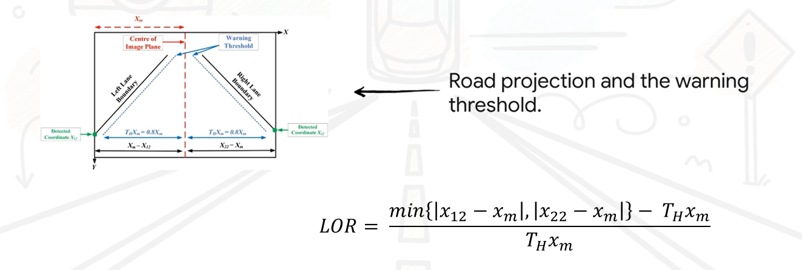

# Vision-Based Lane Departure Warning

  

This project covers the implementation of a classical computer-vision processing chain for lane detection, testing on real-world videos under two distinct driving conditions, and integration of a simple warning logic based on lateral offset. No machine learning models or external labelled datasets are used.

---
---

# Lateral Offset Ratio (LOR)

The **Lateral Offset Ratio (LOR)** is a key computational metric within a **Vision-Based Lane Departure Warning (VBLDW)** framework used to predict when a vehicle is unintentionally drifting out of its lane.

Unlike many existing techniques, the LOR method is advantageous because it does **not require intrinsic or extrinsic camera calibration** to determine the vehicle's position.

---

## Overview and Function

The LOR determines lane departure by monitoring the horizontal (**X**) coordinates of the bottom end-points of detected lane boundaries in the image plane.

A warning is issued by the system when the vehicle's calculated LOR reaches a specific threshold, indicating it has come within a defined distance of the lane markings.

---

## Mathematical Formula

The LOR is computed for each frame using the following ratio:

---

## Variable Definitions

| Variable | Description |
|---|---|
| \(X_{12}\) | Detected left bottom end-point of the left lane boundary |
| \(X_{22}\) | Detected right bottom end-point of the right lane boundary |
| \(X_m\) | One-half of the horizontal width of the image plane (center line) |
| \(TH\) | Lane departure warning threshold, set to a constant value of **0.8** |

The threshold represents a reference warning boundary placed at approximately **80% of the lane width from the center**, following **ISO 17361:2007** standards.

---

## Departure Identification Logic

The system evaluates the LOR value to determine whether a **Lane Departure Warning** should be triggered.

| LOR Value | Identification | Description |
|---|---|---|
| `LOR > 0.25` | No Lane Departure | Vehicle is traveling exactly at the center of the lane |
| `0 < LOR < 0.25` | No Lane Departure | Vehicle is off-center but still within the safe zone |
| `LOR = 0` | Lane Departure | Vehicle is exactly crossing the warning threshold |
| `-1 < LOR < 0` | Lane Departure | Vehicle is between the warning threshold and the lane boundary |
| `LOR = -1` | Lane Departure | Vehicle is crossing one of the lane boundaries |

---

